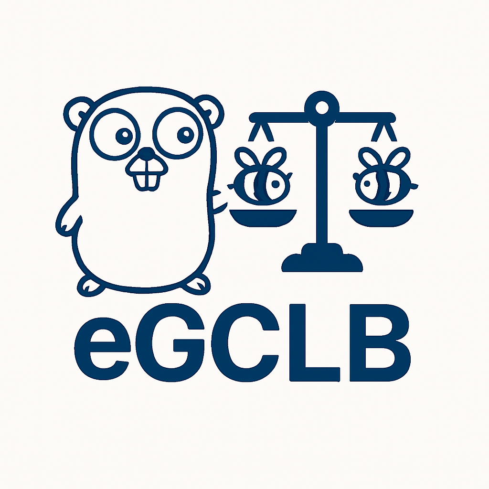

# eGCLB

 

**eGCLB** (eBPF in Go Customizable Load Balancer) is a flexible, high-performance load balancing framework built using [**eBPF**](https://ebpf.io/) (extended Berkley Packet Filter) and the [ebpf library](https://github.com/cilium/ebpf) provided by the Cilium community.
 Designed for speed and configurability, eGCLB enables developers and operators to dynamically select between multiple load balancing algorithms at runtime without downtime or reloading the system.

## Features

- **Runtime Algorithm Selection:** Swap between load balancing strategies (e.g., round robin, consistent hashing, etc.) on the fly.

- **Powered by eBPF**: Kernel-space performance with minimal overhead.

-  **Modular Design:** Easily extend or plug in custom balancing strategies.

## Use Cases

- Edge traffic routing

- Performance-sensitive microservice mesh routing

- Experimenting with new load balancing strategies in real-time

## Other examples

If you want to see similiar and interesting examples, please take a look at [this repository](https://github.com/pinoOgni/ebpf-samples).