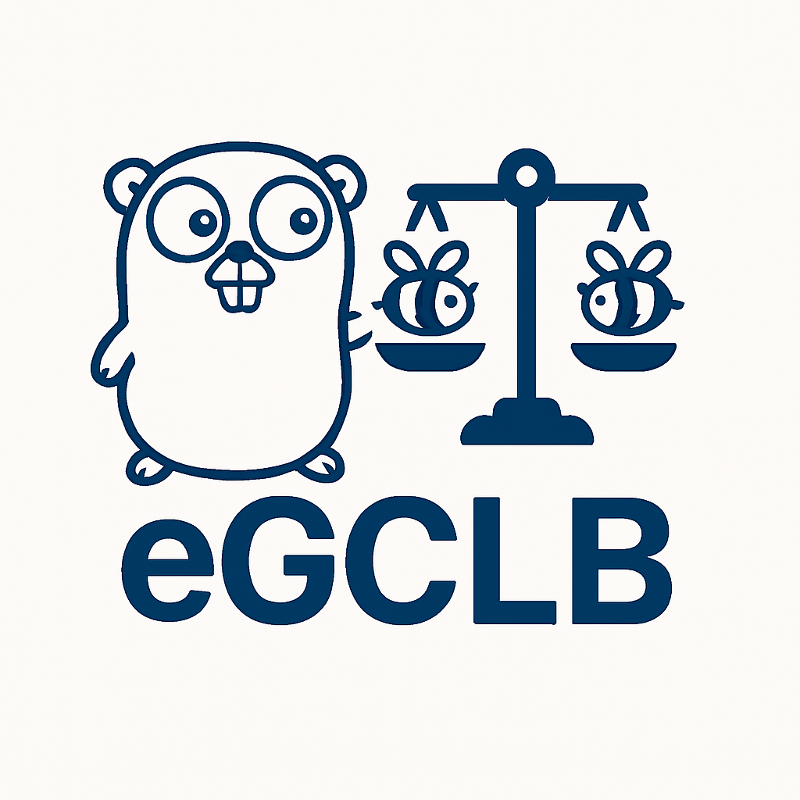

# eGCLB

<p align="center">
 
</p>

**eGCLB** (eBPF in Go Customizable Load Balancer) is a flexible, high-performance load balancing framework built using [**eBPF**](https://ebpf.io/) (extended Berkley Packet Filter) and the [ebpf library](https://github.com/cilium/ebpf) provided by the Cilium community.
 Designed for speed and configurability, eGCLB enables developers and operators to dynamically select between multiple load balancing algorithms at runtime without downtime or reloading the system.

## Features

- **Runtime Algorithm Selection:** Swap between load balancing strategies (e.g., round robin, consistent hashing, etc.) on the fly.

- **Powered by eBPF**: Kernel-space performance with minimal overhead.

-  **Modular Design:** Easily extend or plug in custom balancing strategies.

## How to Use

This project leverages the [eBPF Library for Go](https://ebpf-go.dev/). You can run the application in one of two ways:

1. **Using the `bpftool` CLI** (usage may vary depending on the eBPF program type)  
2. **Building and running the Go binary** with privileged permissions

### Step 1: Generate eBPF Object Files

Both methods require generating the eBPF object (`.o`) and Go (`.go`) files.  
From the `src` directory, run:

```bash
cd src
go generate
```

These commands produce the required `.o` and `.go` files.

### Step 2: Configure Load Balancer Type

The application determines which load balancer logic to use based on the environment variable `LOAD_BALANCER_TYPE`.

Available values:

- `Sticky_RR_v1`

### Option 1: Run with bpftool

If you prefer to use bpftool, attach the generated `.o` programs directly.
This approach bypasses the Go application entirely.

### Option 2: Run the Go Binary

To run the Go executable, build and execute it from the src directory:

```bash
go build
sudo .-E /ebpf-go-lb <interface-name>
```

## Use Cases

- Edge traffic routing

- Performance-sensitive microservice mesh routing

- Experimenting with new load balancing strategies in real-time

## Other examples

If you want to see similiar and interesting examples, please take a look at [this repository](https://github.com/pinoOgni/ebpf-samples).